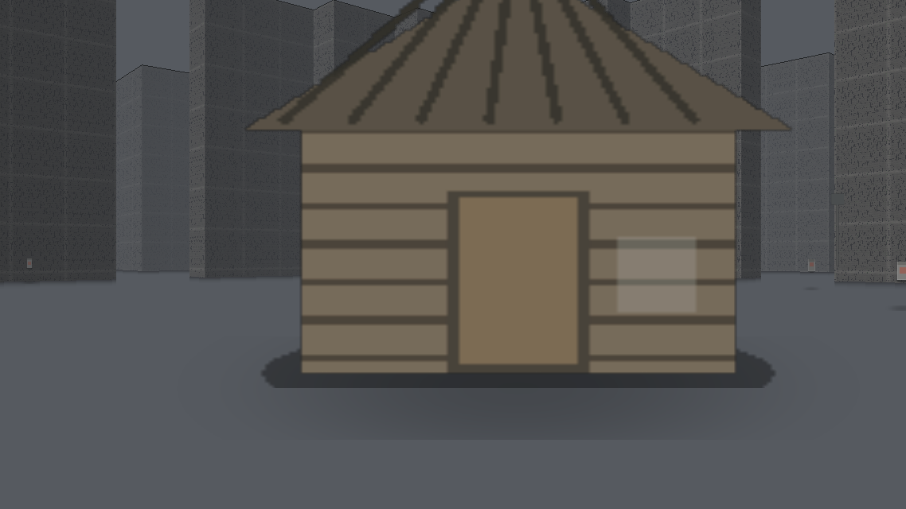
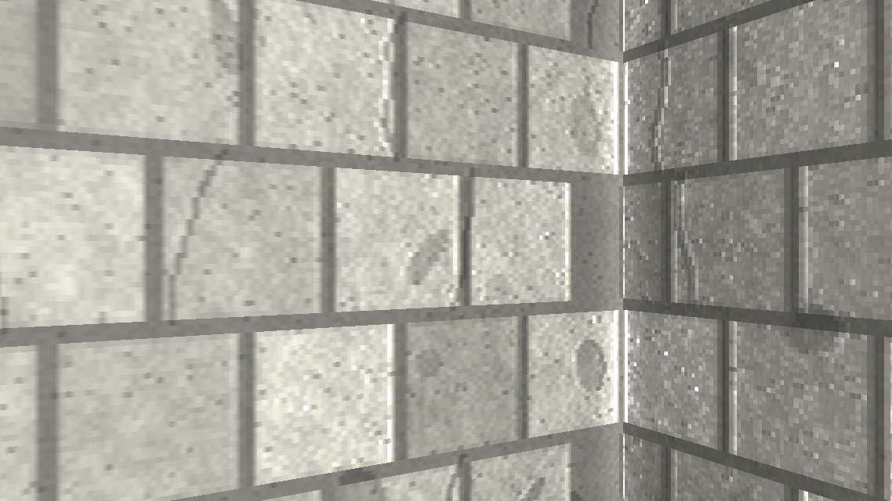
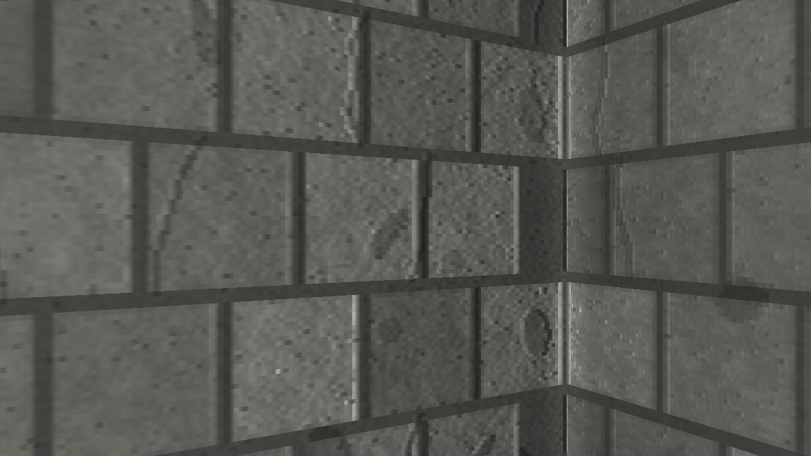
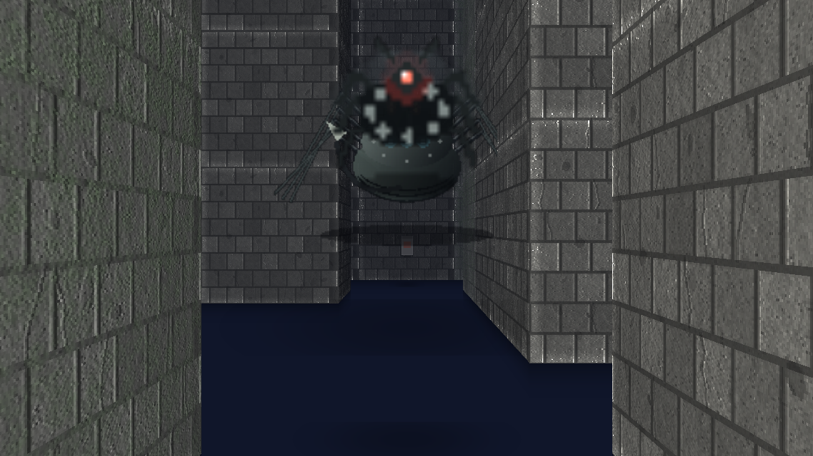
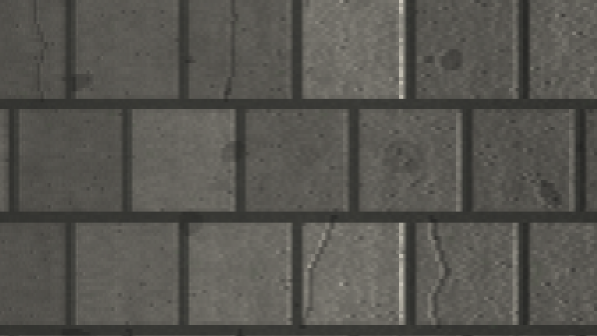

# LABİRENT PROTOKOLÜ

**Inferno Protocol görselliğinde, Labirent: Ölümcül Kaçış mantığında bir PC masaüstü hayatta kalma-korku oyunu.**

Electron ile paketlenmiş gerçek bir Windows / macOS / Linux uygulamasıdır — tarayıcı gerekmez.
Kurulum için hazır **NSIS kurulum dosyası**, **taşınabilir (portable) exe**, **dmg**, **AppImage** ve **.deb**
hedefleri üretir. Oyunun tamamı tek bir motor içinde kodla üretilir: hiçbir harici görsel/ses
dosyası yoktur, tüm dokular, sprite'lar, sesler ve arayüz çalışma anında prosedürel olarak oluşturulur.



## Son sürüm — v1.2.0

| | |
|---|---|
| 💎 **GPU grafik hattı (WebGL)** | Dünya **ekranın gerçek çözünürlüğünde GPU'da** çizilir: süper örneklemeli (SSAA) kenar yumuşatma, mipmap + 8× anizotropik doku filtreleme, gerçek 3B duvar/tavan ağları, piksel başına normal haritalı ışık (güneş + fener nokta ışığı + spekülar), gökyüzüne bağlanan üstel sis, ışın izlemeli gökyüzü (gradyan + güneş/ay + yıldız + fbm bulutlar), ACES ton eşlemeli son işleme: bloom, renk sapması, vinyet, film greni. GPU yoksa **otomatik CPU yedeği** — asla siyah ekran |
| 🕹️ **Profesyonel kontrol** | 120 Hz alt adımlı, kare hızından bağımsız hareket; **ham fare girdisi** (OS hızlandırması kapalı); X/Y için ayrı hassasiyet; **nişan (ADS) hassasiyeti** (sağ tuş / kol LT); kol için çift bölgeli tepki eğrisi + radyal ölü bölge; koşarken FOV vuruşu, yana yürürken kamera yatması, inişte yaylanma; sallanma şiddeti ve nişan yardımı |
| ⌨️ **Tuş atama ekranı** | 23 eylem için tuş değiştir / sil / sıfırla; çakışan tuş otomatik eski eylemden alınır, `settings.json`'a yazılır |
| 🛖 **Yaşam alanı güvenli** | Kayran'da (kamp, Kutu, baraka çevresi) **hiçbir yaratık yok**. Grievers ve Böcek Bıçakları yalnızca labirent içinde; güvenli bölgeye giren yaratık anında dışarı atılır ve oyuncu güvendeyken avlanmaz — filmdeki gibi |
| 🗺️ **Büyük harita** | **500 × 500 karo** (labirent alanı ~15.8×, toplam alan 10.8×). Kayran aynı kaldı, çevresi devasa: 164.738 labirent karosu, ~100.880 yürünebilir karo, günde min(34, 16+gün×2) kapı |
| ⚡ **Hız** | GPU hattı + sisin ötesini hiç taramayan CPU yedeği; yol bulma havuzlanmış tamponlarda; uzak bölüm ağları bellekten düşürülür; **Otomatik ölçekleme** kare süresini ölçüp kendisi ayarlar |

## Neden "Inferno Protocol grafiği + Labirent mantığı"

| Katman | Inferno Protocol'ten | Labirent: Ölümcül Kaçış'tan |
|---|---|---|
| Görsel | Kirli beton/taş, yosun, paslı WICKED çeliği, düşük doygunluklu gri-yeşil palet, CRT tarama çizgileri, film grenli karartma, fener ekonomisi, karanlıkta ufalan görüş | — |
| Ses | Prosedürel rüzgâr, alçak drone, yaklaşan Grievers uğultusu, kalp atışı, devreye giren geçit gıcırtısı | — |
| Mantık | — | Kayran (Glade), Kutu, 4 Geçit, gece kapanan kapılar, her gece **yer değiştiren duvarlar**, Böcek Bıçakları (casus), Grievers (avcı), Uçurum, kovan, rune taşları ve **π kodu (3 1 4 1 5 9 2 6)** |

| | |
|---|---|
|  |  |
| Gündüz labirenti: taş bloklar, gölgeli koridorlar | Gece: fener ekonomisi, sis ve karanlık |
|  |  |
| Grievers — koridorda avcı | Sektör duvarına kazınmış rune taşı (π basamağı) |

Doku atlası: [`docs/doku-atlasi.png`](docs/doku-atlasi.png) — tüm dokular `app/js/10-textures.js` içinde kodla üretilir.

## Masaüstü uygulamasının getirdikleri

| | |
|---|---|
| 🖼️ **Gerçek pencere** | Pencere boyutu/konumu hatırlanır, tam ekran (F11), minimum 1024×640 |
| 💾 **Dosya tabanlı kayıt** | 4 slot (`slot-0…3.json`) — 0 numara otomatik kayıt; her slotta gün, evre, rune sayısı, can ve tarih görünür |
| ⚙️ **Kalıcı ayarlar** | `settings.json`: grafik kalitesi, iç ölçekleme (otomatik/düşük/normal/tam), ses, fare eğrisi + yumuşatma + hassasiyet, nişan yardımı, kol ölü bölgesi/eğrisi/hassasiyeti, koşu ve eğilme kipi, kamera sallanması, ekran sarsıntısı, odak kaybında duraklat |
| 🎛️ **Her şeyi ayarla** | Görünüm/Ses/Kontrol sekmeleri; `TUŞ ATAMALARI` ekranında 23 eylem için tuş değiştir/sil/sıfırla — değişiklikler anında kaydedilir |
| 📸 **Ekran görüntüsü** | F12 → `Resimler/Labirent Protokolu/labirent-<tarih>.png`, çekimden önce HUD gizlenir |
| 🏆 **Başarımlar** | 12 başarım tek profil dosyasında (`achievements.json`); `F2` ile liste, kayıtlardan bağımsız |
| 🧭 **Yerel Türkçe menü** | Oyun / Görünüm / Ses / Yardım; Ctrl+S kaydet, Ctrl+O yükle, F12 ekran görüntüsü, F11 tam ekran |
| 📝 **Günlük ve hata yakalama** | `labirent.log`, yakalanmayan hatalar için çökme penceresi |
| 🎮 **Oyun kolu** | Xbox / DualSense / 8BitDo; takıldığında otomatik algılanır (bkz. Kontroller) |
| 🖥️ **Tek örnek kilidi** | İkinci kez açılırsa var olan pencere öne gelir |

## ⚠️ Windows'ta "SmartScreen" uyarısı çıkarsa

> **Windows kişisel bilgisayarınızı korudu** — Microsoft Defender SmartScreen tanınmayan bir
> uygulamanın başlamasını engelledi.

Bu **virüs uyarısı değildir**: Windows, internetten inen ve dijital olarak imzalanmamış her yeni
programda bu ekranı gösterir. İki yol var:

1. **Ek bilgi → Yine de yükle** (10 saniye).
2. Ya da hiç uyarı görmemek için indirdikten sonra bir kez engeli kaldır:
   `Unblock-File "$env:USERPROFILE\Downloads\LabirentProtokolu-Kurulum-1.2.0-x64.exe"`
   (Dosya Gezgini'nde sağ tık → Özellikler → **Engellemeyi kaldır** ile aynı şey.)
3. Kurulumdan hiç hoşlanmıyorsan `LabirentProtokolu-Klasor-*.zip` sürümünü indir, klasöre çıkar,
   `LABIRENT PROTOKOLU.exe` dosyasını çalıştır.

Dosyanın gerçekliğini her zaman yanında yayınlanan `SHA256SUMS-win.txt` ile doğrulayabilirsin
(ayrıntılı adımlar: [docs/KURULUM.md](docs/KURULUM.md) bölüm 0).

## İndir ve oyna

Güncel sürüm **v1.2.0** — hazır kurulum dosyaları (Windows kurulum / klasör / taşınabilir, macOS dmg, Linux AppImage + deb):

**➡ https://github.com/arreasonn-jpg/MathVerse/releases/latest**

Etiket atıldığında (örn. `v1.2.0`) bu paketler GitHub Actions tarafından otomatik üretilir
(`.github/workflows/paket.yml`); elle tetiklemek için Actions → *Paket üret* → **Run workflow**.

## Kurulum / Çalıştırma

### Hazır paket (kullanıcı)

Kurulum dosyasını çalıştır, masaüstü kısayolundan başlat. Ayrıntılı adımlar, sistem gereksinimleri ve
dosya konumları için: **[docs/KURULUM.md](docs/KURULUM.md)**

| Platform | Dosya | Not |
|---|---|---|
| Windows | `LabirentProtokolu-Kurulum-1.2.0-x64.exe` | NSIS kurulumu (Türkçe sihirbaz), klasör + masaüstü/Başlat menüsü kısayolu |
| Windows | `LabirentProtokolu-Tasinabilir-1.2.0-x64.exe` | Kurulumsuz taşınabilir sürüm (USB'den çalışır) |
| Windows | `LabirentProtokolu-Klasor-1.2.0-x64.zip` | Klasöre çıkarıp çalıştır: ne kurulum ne uyarı |
| macOS | `LabirentProtokolu-1.2.0-arm64.dmg` / `-x64.dmg` | Apple Silicon + Intel |
| Linux | `LabirentProtokolu-1.2.0-x86_64.AppImage` / `.deb` | `chmod +x` sonrası çift tıkla, ya da `dpkg -i` |

> **Kurulum dosyalarını indirmenin en kolay yolu:** GitHub → **Actions** → *Paket üret* →
> **Run workflow**. Üç platform için paketler üretilir ve çalışmanın **Artifacts** bölümünden
 > indirilebilir; `v1.2.0` gibi bir etiket atarsan dosyalar doğrudan **Releases** sayfasına eklenir.
> Kendi bilgisayarında derlemek istersen aşağıdaki adımlar yeterlidir.

### Kaynaktan çalıştırma (geliştirici)

```bash
npm install          # Electron + electron-builder indirir (ilk seferde ~200 MB)
npm start            # uygulamayı açar (npm run dev → geliştirme kipi: konsol + DevTools)
```

### Paket üretme

```bash
npm run dist:win     # NSIS kurulum + taşınabilir exe  → dist/
npm run dist:mac     # dmg (x64 + arm64)               → dist/
npm run dist:linux   # AppImage + deb                  → dist/
npm run dist         # bulunduğun platform için hepsi
npm run icons        # build/icon.png|ico|icns + docs/ikon.png yeniden üretir
```

Paket içeriği `package.json → build.files` ile sınırlıdır: yalnızca `app/`, `electron/` ve simgeler girer;
`tools/`, `docs/` ve `dist/` pakete dahil edilmez.

## Testler

Tarayıcı ve masaüstü katmanı, ayrı ayrı, bağımlılık olmadan koşturulur:

```bash
npm run verify        # hepsi: labirent + masaüstü katmanı + oyun (iki kip) + görsel render
npm run verify:game   # oyun mantığı (tarayıcı + masaüstü kayıt/ayar kipi)
npm run verify:desktop# electron/main.js: menü, IPC, kayıt dosyaları, ayarlar, çıkış akışı
node tools/render-real.js   # 18 sahne görüntüsünü tools/out/ içine çizer (görsel kontrol)
```

`tools/desktop-test.js` gerçek `electron/main.js` dosyasını sahte bir Electron çalışma zamanıyla
koşturur ve gerçek dosya sistemine yazar — bu yüzden paketlenmiş uygulamanın davranışını
Electron binary'si olmadan da doğrular.

## Kontroller

| Tuş | İşlev |
|---|---|
| `W A S D` | Yürü / yan adım |
| `SHIFT` | Koş (dayanıklılık harcar) |
| `C` | Eğil (sessiz yürüyüş) |
| `FARE` | Bakış |
| `E` | Etkileşim (kutu, geçit, rune, baraka, kovan) |
| `F` | Fener (pilli, seni görünür yapar) |
| `1 2 3 4` | Araç seç (mızrak, tuzak, izleyici, işaret fişeği) |
| `Q` / `SOL TIK` | Aracı kullan / saldır |
| `M` | Harita (yalnızca yürüdüğün yerleri hatırlar) |
| `TAB` | Günlük |
| `ESC` | Duraklat / geri |
| `F11` | Tam ekran · `F12` Ekran görüntüsü · `Ctrl+S` Kaydet · `Ctrl+O` Yükle |

> Tüm tuşlar **Duraklat → TUŞ ATAMALARI** ekranından değiştirilebilir (bkz. `docs/KURULUM.md`).

**Oyun kolu:** sol çubuk yürür, sağ çubuk bakar, çubuğu sonuna kadar itmek koşar; `A` etkileşim,
`B` fener, `X` mızrak, `Y` araç kullan, `LB/RB` araç değiştir, `LT` eğil, `RT` saldırı,
`BACK` harita, `START` duraklat.

## Oynanış

1. **Kayran'da uyan.** Kutu seni bırakır; bir gün önce kimse hatırlamaz.
2. **Gündüz: koş.** 4 geçit gün boyu açıktır. 8 sektörde 8 rune taşı vardır; her rune π'nin bir
   basamağını taşır. 240 saniye gündüz, ardından 120 saniye gece.
3. **Gece: saklan.** Geçitler kapanır, duvarlar yer değiştirir, Grievers avlanır. Fener sınırlıdır,
   iğne yaraları zehirler, kanama can götürür.
4. **Üretim.** Griever parçalarını barakada birleştir: mızrak, tuzak, izleyici, işaret fişeği.
5. **Kod.** 8 sayıyı rune sırasına göre gir (π'nin ilk 8 basamağı) ve kapağı aç → kaç.
6. **7 gün.** Gün sayısı ilerledikçe gece uzar, Grievers çoğalır. Hata affedilmez.

Kayıtlar `%APPDATA%/LABİRENT PROTOKOLÜ/saves/` (Windows), `~/Library/Application Support/LABİRENT PROTOKOLÜ/saves/`
(macOS) ve `~/.config/LABİRENT PROTOKOLÜ/saves/` (Linux) altında tutulur.

## Dosya düzeni

```
app/                 oyunun kendisi (Electron renderer'ı — tek başına da açılabilir)
  index.html         giriş noktası, tüm betikleri sırayla yükler
  css/style.css      Kafka-vari arayüz, CRT/hayalet efektleri
  js/00-core.js      çekirdek: yapılandırma, matematik, ses/girdi katmanı
  js/05-desktop.js   masaüstü köprüsü: kayıt/ayar/kepenk API'si + tarayıcı yedeği
  js/10-textures.js  tüm dokular ve sprite'lar (kodla üretilir)
  js/20-maze.js      labirent üretimi, sektörler, geçitler, gece kaydırması
  js/30-render.js    raycast moturu (doku, sis, sprite, aydınlatma)
  js/40-audio.js     prosedürel WebAudio sesleri
  js/50-ai.js        Grievers ve Böcek Bıçakları
  js/60-game.js      oyun döngüsü, oyuncu, kayıt/yükleme, masaüstü olayları
  js/70-ui.js        HUD, modaller, harita, günlük, ayarlar, kayıt slotları
electron/main.js     ana süreç: pencere, menü, IPC, kayıt dosyaları, ekran görüntüsü, günlük
electron/preload.js  güvenli köprü (contextIsolation, nodeIntegration kapalı)
tools/               testler + ikon üreteci (pakete girmez)
build/               uygulama simgeleri (.png/.ico/.icns)
docs/                ekran görüntüleri ve kurulum kılavuzu
```

## Teknik notlar

- **Güvenlik:** `contextIsolation: true`, `nodeIntegration: false`, `sandbox: true`, `webSecurity: true`;
  renderer'a yalnızca `window.desktopAPI` beyaz listesi açılır. `index.html` içindeki
  `Content-Security-Policy` (`default-src 'none'`) sayesinde hiçbir dış kaynak yüklenemez —
  oyun tamamen çevrimdışıdır ve uzaktan kod çalıştırma yolu yoktur.
- **Motor:** Birinci şahıs raycast (DDA) motoru — doku eşlemeli duvarlar, sprite'lar, zemin/tavan gölgesi,
  sis ve fener konisi. Sabit adımlı fizik, kare bağımsız hız.
- **Yer değiştiren duvarlar:** her gece `20-maze.js` sektör bloklarını yeniden karar; oyuncu dışarıdaysa
  geçit kapıları ve uçurum çeperi korunur.
- **Görünürlük hilesi yok:** Gece Grievers görüş mesafesi fener durumuna, koşu sesine ve eğilme
  durumuna göre hesaplanır; griever uğultusu mesafeye göre stereo konumlanır.
